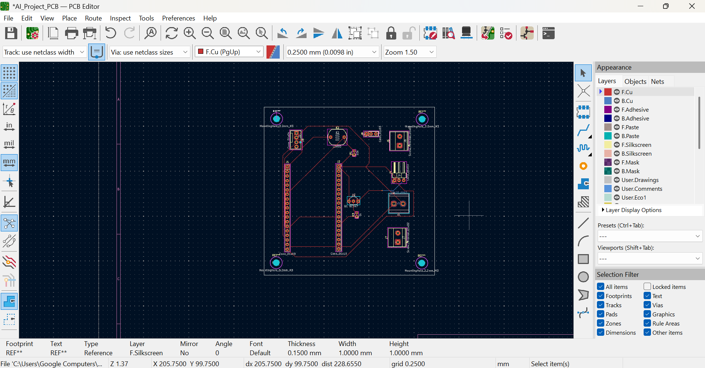
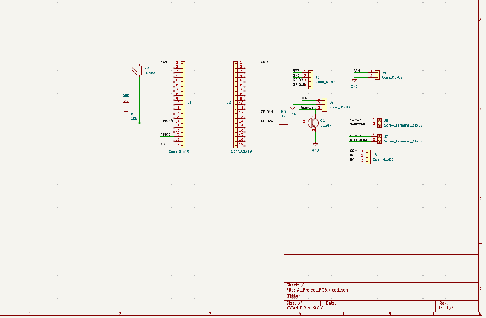
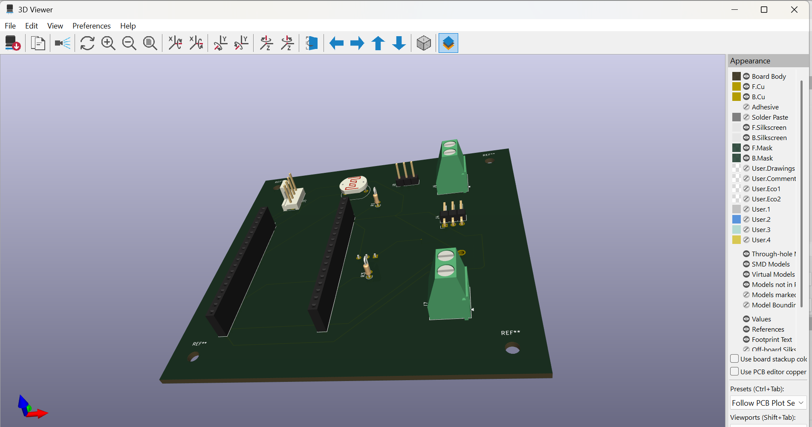

# ESP32-Smart-Street-Light-PCB
ESP32 based automatic street light PCB designed in KiCad
# ESP32 Smart Street Light Controller PCB

## Overview

This project is an ESP32-based automatic street light controller designed using KiCad. It uses an LDR sensor to detect ambient light and controls a relay for AC load switching.

## Features

* LDR-based light sensing (GPIO34)
* Relay control using GPIO26
* OLED display support (I2C: GPIO2, GPIO15)
* Proper separation of low and high voltage sections
* Mounting holes and clean PCB layout

## Preview

### PCB Layout

### Schematic

### 3D View

## Files Included

* KiCad design files (.sch, .pcb)
* Gerber files for manufacturing

## Tools Used

* KiCad (PCB design)
* ESP32 DevKit V1

## Author

Your Name
